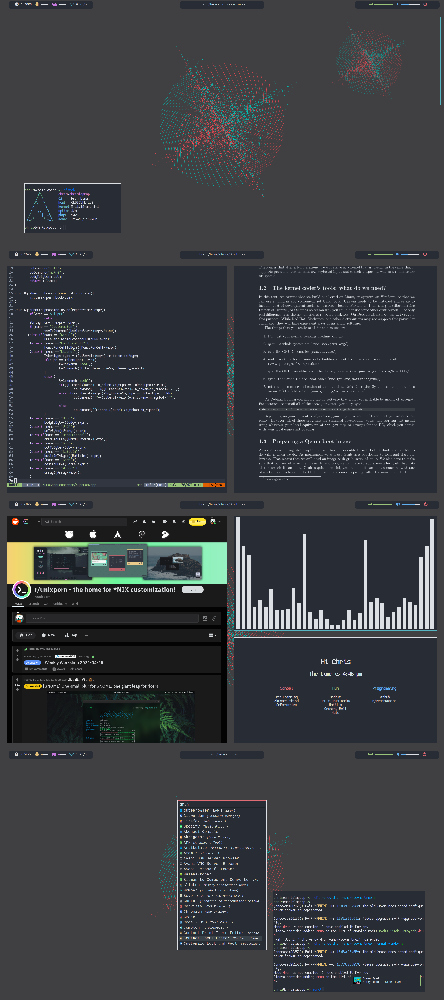

# One Half Dark Rice
This is my personal arch linux set up using the one half dark color sceme.

## Rice info
* Wm: bspwm
* Fonts: cozzite, Fira Code
* Application Launcher: rofi
* Notifications: dunst
* Bar: poybar
* Visualizer: cava
* Wallpaper: Mingle found [here](https://www.dropbox.com/sh/y7dpnylxcyrhwpj/AACSBo46I2ZArX0S-M147ub1a?dl=0) by [Madison in positron Drean](https://www.positrondream.com/)
* Browser: Qute browser
* Color Sceme: one half dark

If I missed anything from the screen shots please just message me and ill fix it as soon as I can.

## ScreenShots

## Contact Info

Christopher Oosthuizen- christopher.jan.oosthuizen@gmail.com 
